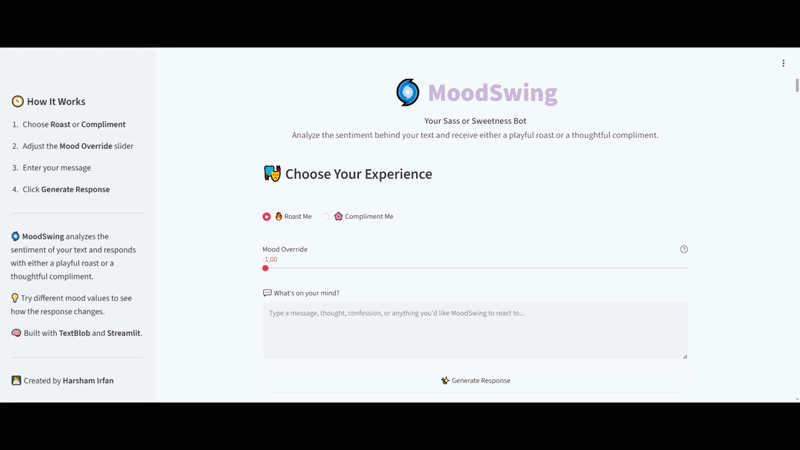
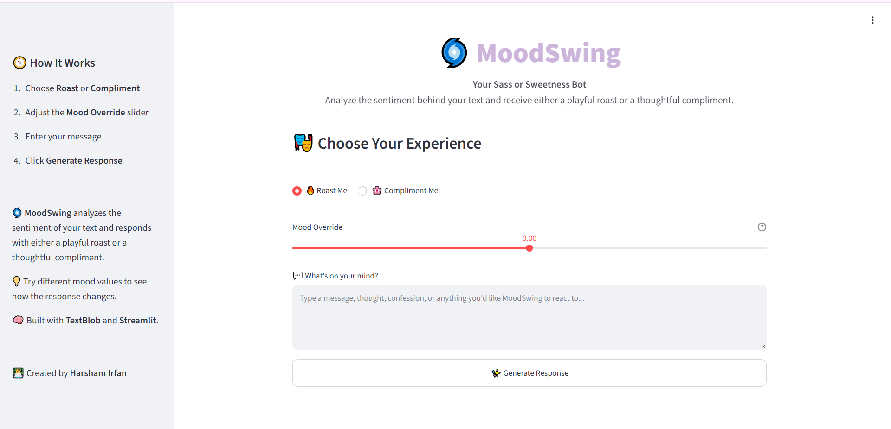
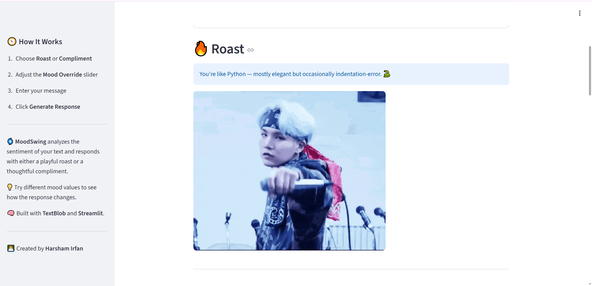
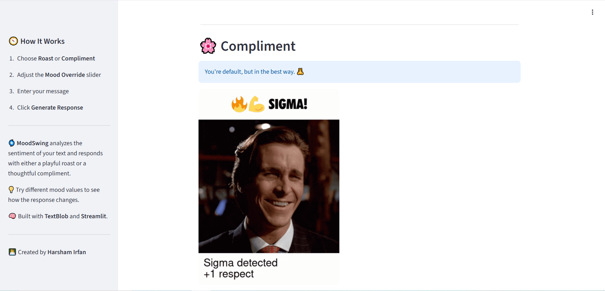
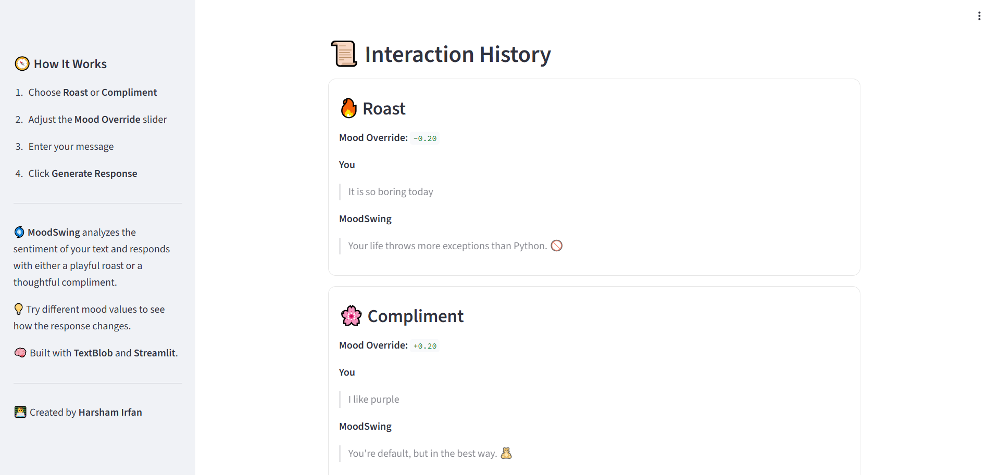

<h1 align="center">MoodSwing</h1>

<p align="center">
Interactive NLP web application that analyzes text sentiment and responds with either a playful roast or a thoughtful compliment.
</p>

<p align="center">
  
  
  
  
  
</p>

MoodSwing is an interactive sentiment analysis application that classifies user input using TextBlob and generates either a playful roast or a thoughtful compliment. Users can also adjust a mood override slider to influence the style of the response.

**Natural Language Processing • Streamlit • TextBlob**

---

# 🔗 Live Demo

**https://YOUR-RENDER-URL.onrender.com**

---

# Preview

<p align="center">
  
</p>

---

# Overview

MoodSwing demonstrates a lightweight Natural Language Processing workflow through an interactive Streamlit application.

Instead of only classifying sentiment, the application transforms the detected sentiment into humorous roasts or encouraging compliments using curated response banks. A mood override slider allows users to influence the generated response for a more interactive experience.

The project focuses on presenting NLP concepts through an engaging web interface rather than building a production chatbot.

---

# Highlights

- Sentiment analysis using TextBlob
- Roast and Compliment modes
- Mood override slider
- Curated response banks
- Interaction history
- Interactive Streamlit interface
- Deployed on Render

---

# Screenshots

### Home

Main application interface.



---

### Roast Mode

Example roast generated from user input.



---

### Compliment Mode

Example compliment generated from user input.



---

### Interaction History

Displays previous generated responses within the current session.



---

# Technology Stack

| Layer | Technology |
|--------|------------|
| Language | Python |
| NLP | TextBlob |
| Text Processing | NLTK |
| Web Framework | Streamlit |
| UI | HTML/CSS (Streamlit Markdown & Custom Styling) |
| Deployment | Render |

---

# Project Structure

```text
.
├── assets/
│   ├── demo.gif
│   └── screenshots/
│       ├── hero.png
│       ├── roast.png
│       ├── compliment.png
│       └── history.png
├── app.py
├── roast_engine.py
├── compliment_engine.py
├── roast_bank.py
├── compliment_bank.py
├── requirements.txt
└── README.md
```

---

# Getting Started

## Clone the repository

```bash
git clone https://github.com/HarshamIrfan/MoodSwing.git

cd MoodSwing
```

## Install dependencies

```bash
pip install -r requirements.txt
```

## Download TextBlob corpora

```bash
python -m textblob.download_corpora
```

## Run the application

```bash
streamlit run app.py
```

---

# How It Works

1. Enter a message or thought.
2. Select either Roast or Compliment mode.
3. Optionally adjust the Mood Override slider.
4. Generate a response based on the detected sentiment and selected mood.

---

# Future Improvements

- Support additional sentiment analysis models
- Add multiple roast and compliment personalities
- Export interaction history
- Custom response themes
- Multi-language support

---

# Author

**Harsham Irfan Bhat**

📧 harshamirfan@gmail.com

💼 https://www.linkedin.com/in/harsham-irfan-bhat/

---

If you found this project useful, consider giving the repository a ⭐.